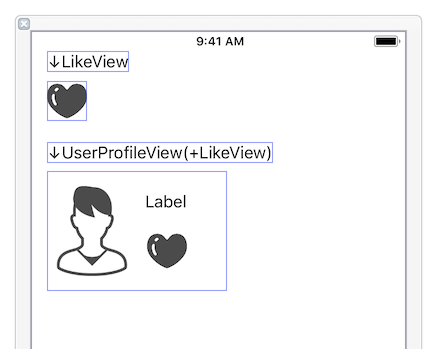

# Deprecated

This approach is more smart.

https://qiita.com/usagimaru/items/e1c349c5bc51a1c4a92c

---

# RecursiveCustomViewDemo

We can see appearance of custom view embedded in other custom even if it is in interface builder.

# Image resources

http://icooon-mono.com
